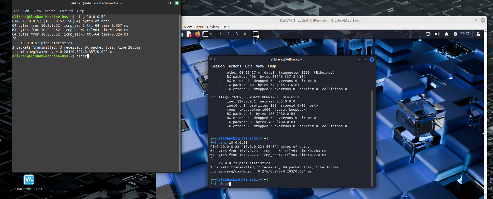
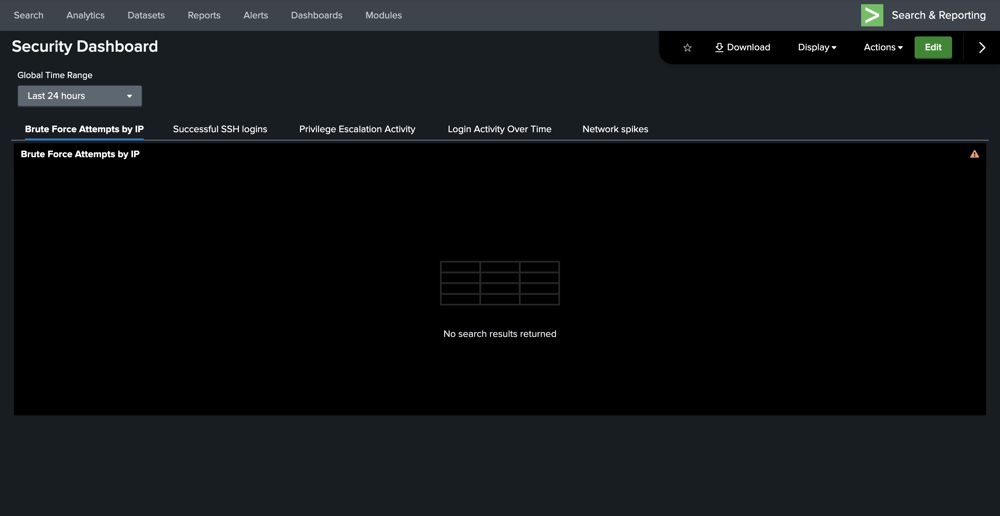
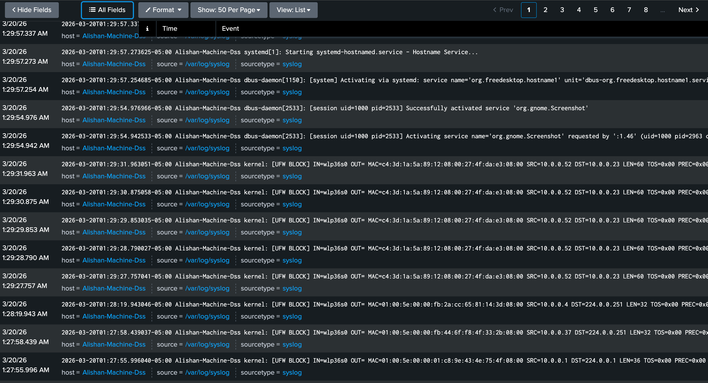
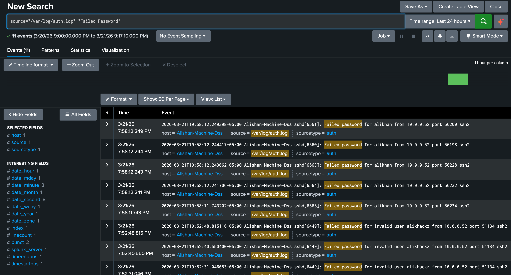
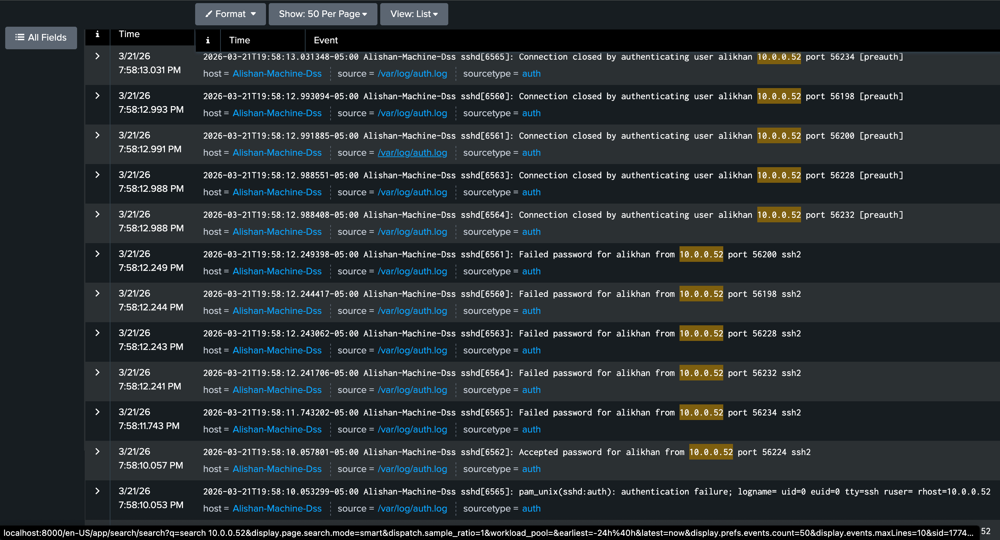
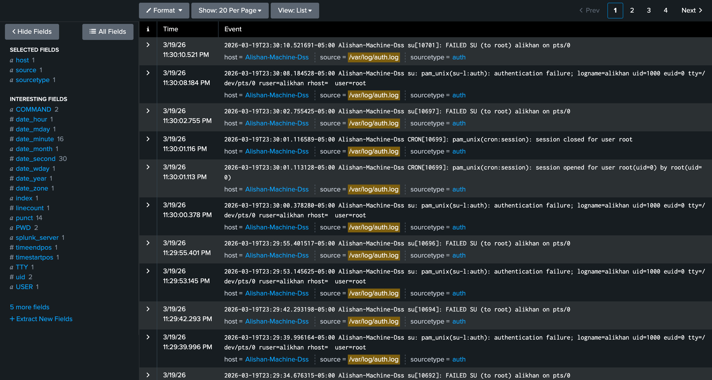
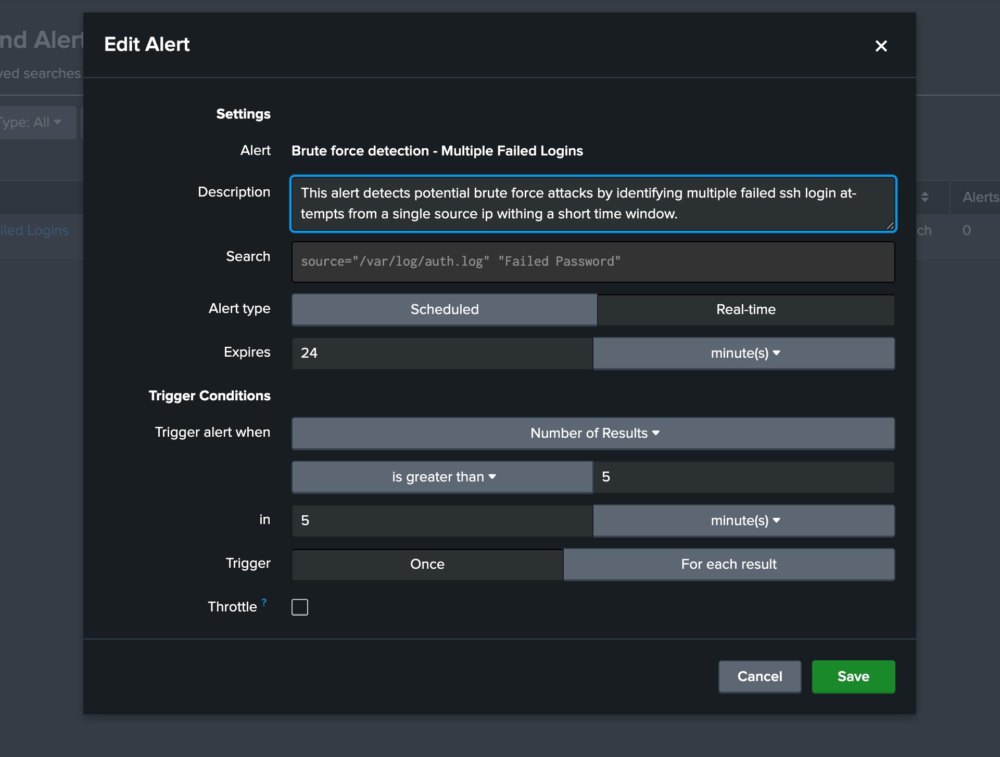
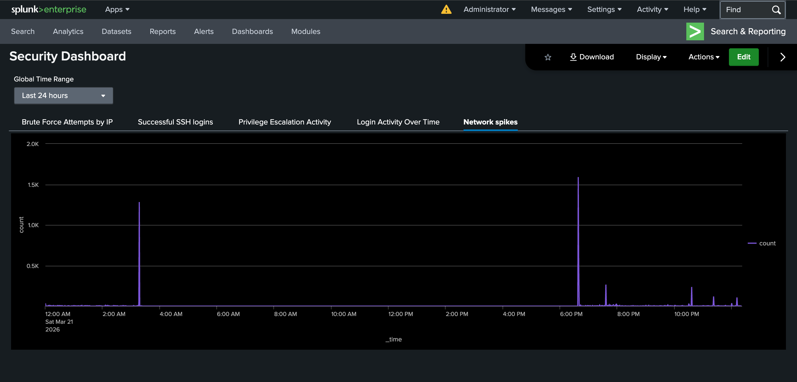
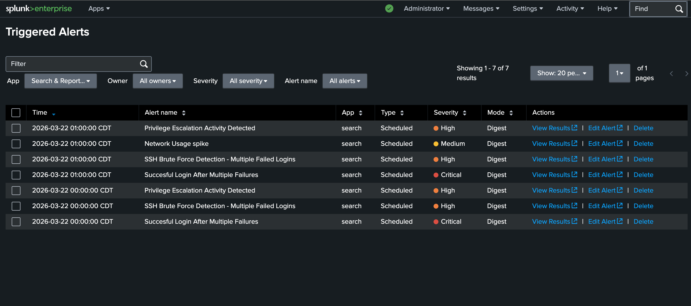

# Soc Detection Lab (Splunk + Kali)

## Overview
This project simulates a Security Operations Center (SOC) environment using a Linux-based lab. Real-world cyberattacks were executed from a Kali Linux virtual machine and detected using Splunk running on a separate system.

## Tools Used
- Splunk Enterprise (SIEM)
- Kali Linux (attacker + target environment)
- Nmap (network reconnaissance)
- Hydra (brute-force attacks)
- Linux system logs (/var/log/auth.log, /var/log/syslog)

## Lab Architecture

The lab consists of a Kali Linux virtual machine running on a Linux Mint host, with Splunk deployed on a separate laptop for centralized log collection and analysis.

## Attacks Simulated
- Port Scanning (Nmap)
- SSH Brute Force Attacks (Hydra) 
- Authentication Attempts (successful and failed logins)

## Detection Engineering
- Brute Force Detection (failed SSH login attempts)
- Successful Login Detection (accepted SSH sessions)
- Network Usage Spike Detection (time-based anomaly detection)
- Login Pattern Analysis (correlating failed and successful logins)

## Results
- Successfully detected simulated attacks using Linux log data
- Identified brute-force activity through authentication logs
- Built alerts and dashboards for monitoring suspicious activity

## Key Skills Demonstrated
- SIEM configuration and usage (Splunk)
- Linux log analysis and monitoring
- Threat detection using SPL queries
- Basic detection engineering and alert creation
- Security event investigation and analysis

## SOC Simulation Overview
This project simulates a real-world Security Operations Center (SOC) environment where multiple cyberattack techniques are executed and detected using Splunk SIEM. The lab demonstrates how attackers progress through different stages of an attack and how defenders can detect and respond using log analysis, dashboards, and alerting.

The attack chain includes:

Reconnaissance (Nmap scan)
Credential access (SSH brute force)
Initial access (successful login)
Privilege escalation attempts
Detection and alerting via Splunk

## Reconnaissance - Nmap scan

The attack begins with a reconnaissance phase where the attacker scans the target system using Nmap. Firewall logs (UFW) show repeated blocked connection attempts from the attacking IP (10.0.0.52), indicating systematic probing of ports to identify exposed services.
This behavior is consistent with automated port scanning and represents the first stage of the attack lifecycle.

## Brute Force Attack - SSH

Following reconnaissance, the attacker initiates a brute force attack against the SSH service. Multiple failed login attempts from the same IP address (10.0.0.52) are observed within a short time window.
This pattern is a strong indicator of automated credential guessing using tools such as Hydra.

## Compromise Achieved - Successful login

After multiple failed attempts, a successful SSH login is observed from the same source IP. This confirms that the attacker successfully guessed valid credentials and gained access to the system.
This represents the transition from attempted access to an actual system compromise.

## Post Compromise Activity - Privilege Escalation 

Once inside the system, the attacker attempts to escalate privileges using commands such as su and sudo. Logs show failed attempts to gain root-level access.
This behavior is typical of post-exploitation activity where attackers attempt to increase their level of control over the system.

## Detection Engineering - Brute Force Alert

To detect malicious activity, custom alerts were created in Splunk. The brute force detection alert identifies multiple failed SSH login attempts from a single IP within a defined time window.
This demonstrates how SIEM tools can be configured to detect suspicious patterns in real time. 

## SIEM Dashboard - Attack Visibility 

A centralized Splunk dashboard was developed to visualize attack activity. The dashboard provides insights into:

Brute force attempts
Successful SSH logins
Privilege escalation activity
Login Activity Over time
Network anomalies

This enables analysts to quickly identify and investigate suspicious behavior.

## Network Activity - Anomaly Detection

Network traffic analysis reveals spikes in activity that align with the execution of scanning and brute force attacks. These anomalies provide additional context and help correlate attack timelines.

## Alerting & Response - Triggered Alerts

All defined alerts were successfully triggered during the attack simulation, including:

SSH brute force detection
Successful login after multiple failures
Privilege escalation activity
Network usage spikes

This confirms that the detection mechanisms are functioning as intended and capable of identifying malicious behavior.

KEY TAKEAWAYS: This project demonstrates the importance of correlating multiple log sources to detect sophisticated attacks. By combining log analysis, alerting, and visualization, security teams can effectively identify and respond to threats in real time.
